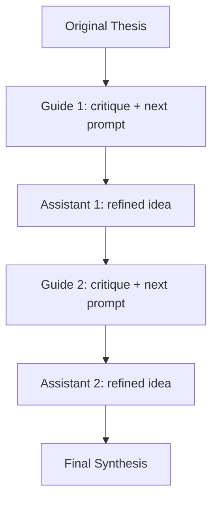

# Tree of Thought (v0)

## Idea Scoring Module (new)

There is now a reusable scoring module at `idea_scoring/` for evaluating idea-generation approaches with:

- weighted rubric scoring
- Bradley-Terry style Elo pairwise ranking
- optional blended final score

See `idea_scoring/README.md` for usage.

## Agentic Literature Search (new)

This repo now includes a two-action literature workflow built around Semantic Scholar:

- `QUERY` (one or more retrieval operations)
- `WRITE_TO_MEMORY` (promote exactly 1 high-impact `paper_id`)

System behavior:

- After each `QUERY`, the run writes a required `results_summary` into `queries.jsonl`.
- Each query summary also includes a required `best_paper_candidate` + explicit rationale.
- Action decisions use full last-query paper JSON (not summary-only context).
- After each `WRITE_TO_MEMORY`, the system only generates/stores paper notes.
- During `WRITE_TO_MEMORY`, notes generation receives full paper text from open-access PDFs when available.
- At the end of the run, a final synthesis agent writes `related_works.md` from all accumulated notes and the initial concept.
- Workspace state resets at the start of each run by default.
- Agent policy prioritizes high-impact, strong works before writing to memory.
- Notes/synthesis are tuned for field-overview style rather than single-paper narration.

### Required env vars

```env
OPENAI_API_KEY=...
S2_KEY=...
```

### Run

```bash
python literature_search_agent.py --steps 8
```

Default concept:

- `self play RL in LLMs. Challenger, Judge, Solver setups.`

You can override it by passing a custom concept as the first argument.

### Outputs

- `lit_workspace/queries.jsonl` - query actions + summaries
- `lit_workspace/paper_bank.json` - promoted paper IDs
- `lit_workspace/paper_notes.json` - per-paper detailed free-form notes with explicit related-work focus (incl. prior-work mapping and reference leads) used for synthesis
- `lit_workspace/related_works.md` - canonical evolving related works text
- `lit_workspace/metadata_cache/` - cached Semantic Scholar paper metadata
- `last_run_report.md` - detailed run report with raw action/query outputs
- `literature_search.log` - runtime logs

### Important flags

- `--agent-model` (default `gpt-5-nano`)
- `--summary-model` (default `gpt-5-nano`)
- `--updater-model` (default `gpt-5-nano`)
- `--default-query-limit` (default `12`)
- `--workspace-dir` (default `lit_workspace`)
- `--report-file` (default `last_run_report.md`)
- `--pdf-max-chars` (default `250000`, full-paper text budget per new paper)
- `--no-reset-workspace` to keep prior run state
- `concept` positional arg is optional (defaults to the self-play RL concept above)

### Isolated tests (no full loop)

1) Note generation only for one paper:

```bash
python literature_search_agent.py --test-note-paper-id "<paper_id>" --test-note-out note_generation_test.md
```

2) Related Works generation only from saved notes:

```bash
python literature_search_agent.py --test-related-from-notes --workspace-dir lit_workspace --test-related-out related_works_test.md
```

## Version references for comparisons

To create a reproducible code reference ID before running experiments:

```bash
python version_snapshot.py --label "baseline-before-elo"
```

This writes a snapshot JSON under `experiments/version_refs/` with:
- `snapshot_id`
- git head/status
- per-file SHA256 hashes
- aggregate SHA256 hash for the full code snapshot

---

Small prototype that runs a two-role LLM loop to refine an idea:

- **Guide model** critiques current direction and proposes the next prompt.
- **Assistant model** responds with a refined idea.
- After N rounds, a final synthesis step produces a consolidated concept.

By default, this v0 uses:

- model: `gpt-5-nano` for guide, assistant, and synthesis (fast testing)
- thesis prompt: `create a genetic algo that uses some sort of matching algorithim to find optimal partners.`

## Quick start

1. Create a virtual environment and install deps:

```bash
python3 -m venv .venv
source .venv/bin/activate
pip install -r requirements.txt
```

2. Put your key in `.env` at project root:

```env
OPENAI_API_KEY=your-key-here
```

3. Run with defaults (your thesis + fast model):

```bash
python tree_of_thought.py
```

Or provide a custom thesis:

```bash
python tree_of_thought.py "Build a peer-to-peer study matching app for math students" --rounds 3
```

## Readable visualization

Every run writes a markdown report to `last_run_report.md` (or your custom path via `--report-file`).
The report includes:

- model settings used in the run
- mermaid flowchart of round progression
- round-by-round guide/assistant transcript
- final concept, implementation outline, and open questions

If your markdown viewer supports Mermaid, you will see a diagram like:



## CLI options

- `--rounds` number of guide/assistant cycles (default `5`)
- `--guide-model` model for guide role (default `gpt-5-nano`)
- `--assistant-model` model for assistant role (default `gpt-5-nano`)
- `--synthesis-model` model for final synthesis (default `gpt-5-nano`)
- `--report-file` markdown report output path (default `last_run_report.md`)
- `--log-file` runtime log output path (default `tree_of_thought.log`)
- `--log-level` log verbosity: `DEBUG|INFO|WARNING|ERROR` (default `INFO`)
- `--no-live` disable round-by-round live console printing
- `--json` print full JSON output

## Logging

Each run now writes structured logs (timestamp + level + message) to:

- console
- `tree_of_thought.log` (or your `--log-file`)

Example:

```bash
python tree_of_thought.py --rounds 4 --log-level DEBUG --log-file run_debug.log
```

## Notes

- This is intentionally a small v0: single script, no persistence/database yet.
- The script prefers `.env` values over shell/global exports for local project runs.
